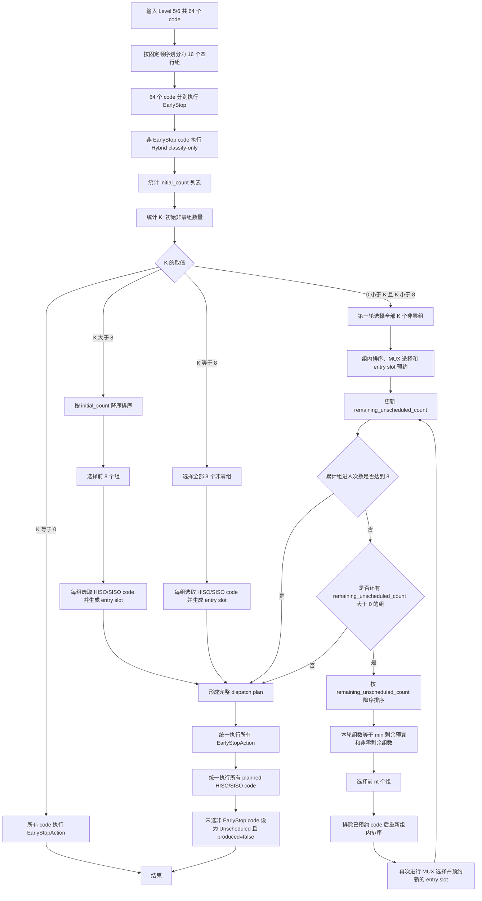

# oFEC 第五/六级四行分组负载排序与多轮 MUX 共享方案

## 1. 文档目的

本文描述一种新的 oFEC 第五级、六级共享 SISO/HISO 资源调度方案。

该方案以第五级和第六级合并后的 64 个 code 为输入，将其按照固定顺序划分为 16 个组，每组 4 个 code。64 个 code 先统一完成 EarlyStop 判断和 Hybrid 分类，然后以“每组非 EarlyStop code 数量”作为组级负载。调度器根据非零负载组的数量选择一次调度或多轮调度，并保证所有轮次累计进入 MUX 的组数不超过 8。

本方案的核心特征为：

- 固定 4-code 分组；
- 先完成 64 个 code 的 EarlyStop 和 Hybrid 分类；
- 按每组待调度 code 数量进行组级排序；
- 共享 8 个 SISO 和 8 个 HISO；
- 每次组进入对应一个 4-to-1 SISO MUX 和一个 4-to-1 HISO MUX；
- 当初始非零组数小于 8 时，允许仍有未调度 code 的组重复进入；
- 后续每轮都基于上一轮结束后的剩余未调度数量重新排序；
- 所有轮次累计的组进入次数不超过 8；
- 所有 EarlyStop code 始终执行正常 EarlyStopAction；
- 最终未获得译码机会的非 EarlyStop code 保持原值。

本文只定义仿真逻辑和模块行为，不表示当前代码已经实现该方案。

## 2. 名词与状态定义

### 2.1 Code

一次第五/六级共享调用包含 64 个 code：

```text
code 1, code 2, ..., code 64
```

文档使用 1-based 编号，代码实现可以使用 0-based 下标：

```text
shared_code[0], shared_code[1], ..., shared_code[63]
```

### 2.2 固定组

64 个 code 按固定顺序分成 16 个组，每组 4 个 code：

```text
Group 1  = code 1-4
Group 2  = code 5-8
...
Group 16 = code 61-64
```

组划分不随 EarlyStop、Hybrid 分类、LLR 可靠度或调度轮次发生变化。

### 2.3 初始非 EarlyStop 数量

对 Group `i`，定义：

```text
initial_count_i = 该组初始非 EarlyStop code 数量
```

其取值范围为：

```text
initial_count_i in [0, 4]
```

### 2.4 剩余未调度数量

在任意一轮结束后，对 Group `i`，定义：

```text
remaining_unscheduled_count_i =
    该组中非 EarlyStop、且尚未被任何 SISO/HISO entry slot 选中的 code 数量
```

以下 code 不计入 `remaining_unscheduled_count_i`：

- 已命中 EarlyStop 并执行 EarlyStopAction 的 code；
- 已被某个 HISO MUX 选中并预约 HISO entry slot 的 code；
- 已被某个 SISO MUX 选中并预约 SISO entry slot 的 code。

### 2.5 非零组

初始非零组是指：

```text
initial_count_i > 0
```

后续轮次中的非零未调度组是指：

```text
remaining_unscheduled_count_i > 0
```

### 2.6 组进入次数

一个组在某一轮被选中，并进入一次组内优先级排序、4-to-1 SISO MUX 和 4-to-1 HISO MUX，记为一次“组进入”。

同一个固定组可以在不同轮次重复进入，但每次进入都计入总组进入次数。

所有轮次累计满足：

```text
total_group_entries <= 8
```

## 3. 固定分组关系

| 组号 | Code 范围 | 0-based 下标范围 |
| --- | --- | --- |
| Group 1 | code 1-4 | 0-3 |
| Group 2 | code 5-8 | 4-7 |
| Group 3 | code 9-12 | 8-11 |
| Group 4 | code 13-16 | 12-15 |
| Group 5 | code 17-20 | 16-19 |
| Group 6 | code 21-24 | 20-23 |
| Group 7 | code 25-28 | 24-27 |
| Group 8 | code 29-32 | 28-31 |
| Group 9 | code 33-36 | 32-35 |
| Group 10 | code 37-40 | 36-39 |
| Group 11 | code 41-44 | 40-43 |
| Group 12 | code 45-48 | 44-47 |
| Group 13 | code 49-52 | 48-51 |
| Group 14 | code 53-56 | 52-55 |
| Group 15 | code 57-60 | 56-59 |
| Group 16 | code 61-64 | 60-63 |

组号和组内位置可以按以下公式计算：

```text
group_index     = shared_code_index / 4
position_in_mux = shared_code_index % 4
```

## 4. 前置处理流程

### 4.1 64 个 code 执行 EarlyStop

第五级和第六级的 64 个 code 首先分别执行 EarlyStop 判断：

```text
early_stop_hit = true / false
```

EarlyStop 命中的 code：

- 最终动作保持为 `EarlyStopAction`；
- 不进入 SISO MUX；
- 不进入 HISO MUX；
- 不占用共享 SISO/HISO 资源；
- 按当前 EarlyStopAction 配置产生输出并写回。

### 4.2 非 EarlyStop code 执行 Hybrid 分类

所有非 EarlyStop code 使用 `FriendS1S3WithS0Classifier` 执行 Hybrid classify-only，获得组内优先级排序所需的分类结果。

该分类器实际可能输出：

```text
Clean
ParityOnly
OneMain
OneMainPlusParity
TwoMain
HardFail
```

在第五/六级共享流程中，`Clean` code 应当已经被 EarlyStop 阶段处理。因此，正常进入组级 MUX 调度的非 EarlyStop code 分类为：

```text
ParityOnly
OneMain
OneMainPlusParity
TwoMain
HardFail
```

分类阶段只产生类别和资源资格，不直接完成最终 SISO/HISO 调度。

### 4.3 建立初始组负载列表

统计每个组中的非 EarlyStop code 数量，形成长度为 16 的列表：

```text
initial_count = [
    initial_count_1,
    initial_count_2,
    ...,
    initial_count_16
]
```

例如：

```text
initial_count =
[4, 0, 2, 1, 0, 3, 0, 0,
 1, 0, 4, 0, 2, 0, 0, 1]
```

然后统计非零元素个数：

```text
K = count(initial_count_i > 0)
```

`K` 表示初始至少包含一个待调度 code 的组数。

## 5. 共享 SISO/HISO 资源模型

该方案使用：

```text
8 个 SISO core
8 个 HISO core
```

一个组每进入一次调度，就获得一次组级 SISO/HISO 处理机会：

```text
一个 4-to-1 SISO MUX -> 一个 SISO core
一个 4-to-1 HISO MUX -> 一个 HISO core
```

每次组进入最多产生：

```text
1 个 SisoDecode
1 个 HisoDecode
```

每次组进入都会占用一个组级 entry slot，并为该组提供一个 SISO MUX 和一个 HISO MUX；但 SISO/HISO 是否实际产生译码输出，取决于该组当前剩余 code 的数量及其资源资格。一个 entry slot 最多产生一个 SISO 输出和一个 HISO 输出，也允许只产生其中一路输出。

一个 code 在同一次或不同轮次中都不能被重复译码。

8 次组进入可表示为 8 个逻辑资源槽：

```text
Entry slot 0 -> SISO core 0 + HISO core 0
Entry slot 1 -> SISO core 1 + HISO core 1
...
Entry slot 7 -> SISO core 7 + HISO core 7
```

当同一个固定组在后续轮次重复进入时，它会使用新的 entry slot，而不是重复使用已经计数的 slot。

## 6. 分支一：初始非零组数大于 8

当：

```text
K > 8
```

执行以下步骤：

1. 只保留 `initial_count_i > 0` 的组。
2. 按 `initial_count_i` 从高到低排序。
3. 选择排序后的前 8 个组。
4. 每个选中组进入一次组内调度和译码。
5. 8 次组进入预算全部用完，不再进行第二轮。

选中组的处理流程为：

```text
排除组内 EarlyStop code
        ↓
对非 EarlyStop code 做组内优先级排序
        ↓
4-to-1 SISO MUX 优先选择一个 SisoOnly code；没有时选择一个 HisoOrSiso code
        ↓
4-to-1 HISO MUX 从剩余 HisoOrSiso code 中选择最多一个不同的 code
        ↓
执行 HISO/SISO 解码
```

未选中的组：

```text
EarlyStop code    -> EarlyStopAction
非 EarlyStop code -> Unscheduled，保持原值
```

## 7. 分支二：初始非零组数等于 8

当：

```text
K == 8
```

执行以下步骤：

1. 直接选择全部 8 个非零组。
2. 每个组进入一次组内优先级排序和两个 4-to-1 MUX。
3. 每个组执行对应 HISO/SISO 解码。
4. 总组进入次数达到 8，不再进行第二轮。

此分支不需要在组之间进行数量筛选，但组内仍需要执行既定优先级排序。

## 8. 分支三：初始非零组数小于 8

当：

```text
0 < K < 8
```

采用多轮动态重入调度。这里的“轮次”首先表示逻辑调度轮次，仿真中的实际译码执行方式见第 9 章。

### 8.1 第一轮

第一轮选择全部 `K` 个初始非零组：

```text
n0 = K
```

每个组执行一次：

```text
排除 EarlyStop code
        ↓
组内优先级排序
        ↓
4-to-1 HISO MUX
        +
4-to-1 SISO MUX
        ↓
记录本轮 HISO/SISO code 选择和 entry slot 预约
```

第一轮结束后：

```text
used_group_entries = K
```

然后根据尚未被任何 entry slot 选中的 code，重新统计所有组的 `remaining_unscheduled_count_i`。

### 8.2 第二轮及后续轮次

设第 `t` 轮开始前，前面各轮已经使用的组进入次数为：

```text
used_before_t = n0 + n1 + ... + n(t-1)
```

上一轮调度结束后仍有未预约 code 的组数为：

```text
active_remaining_groups =
    count(remaining_unscheduled_count_i > 0)
```

本轮允许进入的组数为：

```text
nt = min(
    8 - used_before_t,
    active_remaining_groups
)
```

本轮选择流程为：

1. 排除 `remaining_unscheduled_count_i == 0` 的组。
2. 按 `remaining_unscheduled_count_i` 从高到低排序。
3. 选择排序后的前 `nt` 个组。
4. 每个组排除以前轮次中已经被 entry slot 选中的 code。
5. 对剩余未调度 code 重新执行组内优先级排序。
6. 重新进入 4-to-1 HISO MUX 和 4-to-1 SISO MUX。
7. 记录本轮 HISO/SISO code 选择和新的 entry slot 预约。
8. 更新各组 `remaining_unscheduled_count_i`。
9. 更新累计组进入次数。

累计值更新为：

```text
used_group_entries += nt
```

### 8.3 多轮终止条件

满足以下任一条件时停止：

```text
used_group_entries == 8
```

或者：

```text
count(remaining_unscheduled_count_i > 0) == 0
```

即：

- 8 次组进入预算已经全部使用；或
- 所有非 EarlyStop code 都已经获得 entry slot，没有组需要再次进入。

## 9. 分支三的仿真实现：多轮只调度，最后统一解码

本方案在仿真中将分支三实现为“先完成全部多轮调度，再统一执行译码”，而不是在每个逻辑轮次结束后立即调用 HISO/SISO 译码器。

因此，分支三中的每一轮只执行以下操作：

```text
选择本轮进入的组
        ↓
排除 EarlyStop code 和以前轮次已经预约的 code
        ↓
对当前剩余未调度 code 做组内优先级排序
        ↓
通过 4-to-1 SISO MUX 优先预约一个 SisoOnly code；没有时预约一个 HisoOrSiso code
        ↓
通过 4-to-1 HISO MUX 从剩余 HisoOrSiso code 中预约最多一个不同的 code
        ↓
为本次组进入分配一个 entry slot
        ↓
更新 remaining_unscheduled_count_i
```

这一阶段不执行：

```text
HISO 实际译码
SISO 实际译码
译码输出后处理
alpha 缩放
量化
写回
```

### 9.1 Entry slot 调度计划

仿真维护最多 8 个组级 entry slot。每个 slot 记录：

```cpp
struct Level56GroupEntrySlot {
  int slot_index = -1;       // 0..7
  int group_index = -1;      // 0..15
  int hiso_code_index = -1;  // 没有 HISO 输出时为 -1
  int siso_code_index = -1;  // 没有 SISO 输出时为 -1
};
```

每次组进入都会占用一个组级 entry slot，并为该组提供一个 SISO MUX 和一个 HISO MUX；但 SISO/HISO 是否实际产生译码输出，取决于该组当前剩余 code 的数量及其资源资格。一个 entry slot 最多产生一个 SISO 输出和一个 HISO 输出，也允许只产生其中一路输出。

被某个 slot 选中的 code 立即标记为已预约：

```text
planned_hiso = true
或者
planned_siso = true
```

该标记只表示资源和执行路径已经确定，不表示实际译码已经执行。

### 9.2 `remaining_unscheduled_count_i` 的仿真定义

由于实际译码被放到所有调度轮次之后，后续轮次不能根据译码结果更新剩余数量。仿真统一采用：

```text
remaining_unscheduled_count_i =
    Group i 中满足以下全部条件的 code 数量：
      1. 未命中 EarlyStop
      2. 尚未被任何 HISO entry slot 预约
      3. 尚未被任何 SISO entry slot 预约
```

等价表达为：

```text
remaining_for_schedule =
    !early_stop_hit
    && !planned_hiso
    && !planned_siso
```

一个 code 一旦被某个 entry slot 选中，就立即从后续轮次的候选集合中删除。同一个 code 不允许在后续 slot 中重复出现，也不允许同时被预约到 HISO 和 SISO。

### 9.3 多轮调度结束后的统一执行

满足以下任一终止条件后，调度计划完成：

```text
used_group_entries == 8
```

或者：

```text
所有 remaining_unscheduled_count_i == 0
```

随后统一执行：

```text
所有 EarlyStop code 执行 EarlyStopAction
        ↓
所有 planned_hiso code 执行 HISO decode
        ↓
所有 planned_siso code 执行 SISO decode
        ↓
执行现有后处理、alpha、量化和写回
        ↓
未被预约的非 EarlyStop code 保持 Unscheduled 和 produced=false
```

本仿真不在调度轮次之间使用译码结果，不根据 HISO/SISO 是否成功产生输出重新选择 code，也不在调度轮次之间写回 LLR 或重新执行 Hybrid 分类。

SISO extrinsic 归一化在当前实验中基本关闭，因此本方案不把逐轮归一化与统一归一化的差异作为调度设计条件。仿真实现直接沿用最终统一执行阶段的现有 SISO 后处理方式。

### 9.4 等效性说明

在以下前提下，“每轮调度后立即解码”和“先完成全部调度、最后统一解码”得到相同的 code 选择结果：

1. 后续轮次只依赖 code 是否已经获得 entry slot。
2. 后续轮次不依赖实际译码输出或译码成功状态。
3. 调度轮次之间不写回 LLR。
4. 调度轮次之间不重新执行 EarlyStop 或 Hybrid 分类。
5. 同一个 code 被预约后不会在后续轮次重试。

本方案的仿真语义满足以上前提，因此多轮调度可以先完整生成 dispatch plan，再统一执行译码。

## 10. 分支四：初始非零组数等于 0

当：

```text
K == 0
```

说明 64 个 code 全部命中 EarlyStop。

此时：

```text
所有 code 执行 EarlyStopAction
不建立组内 SISO/HISO 候选
不消耗任何组进入次数
不使用任何 SISO/HISO core
```

## 11. 多轮重入时的 Code 状态更新

同一个组可以重复进入，但组内已经被 entry slot 预约的 code 必须从后续调度中永久排除。

每个 code 维护至少以下状态：

```text
early_stop_hit         // 是否命中 EarlyStop；命中后执行 EarlyStopAction，不参与后续 MUX 调度
hybrid_class           // 非 EarlyStop code 的 FriendS1S3WithS0Classifier 分类结果，用于组内优先级排序
resource_eligibility   // 该 code 允许使用的资源路径，例如 HisoOrSiso、SisoOnly 或 None
planned_hiso           // 是否已被某个 entry slot 的 HISO MUX 预约；为 true 后不得再次参与后续轮次
planned_siso           // 是否已被某个 entry slot 的 SISO MUX 预约；为 true 后不得再次参与后续轮次
remaining_for_schedule // 是否仍属于后续轮次的候选 code，由 EarlyStop 和 HISO/SISO 预约状态共同决定
final_action           // 完整调度结束后的最终动作：EarlyStopAction、HisoDecode、SisoDecode 或 Unscheduled
assigned_entry_slot    // 被分配的组级 entry slot 编号，范围为 0-7；未获得 slot 时为 -1
assigned_core          // 最终执行时使用的 HISO/SISO core 编号；不占用译码 core 时为 -1
```

建议定义：

```text
remaining_for_schedule =
    !early_stop_hit
    && !planned_hiso
    && !planned_siso
```

每轮结束后：

```text
remaining_unscheduled_count_i =
    Group i 中 remaining_for_schedule == true 的 code 数量
```

一个 code 一旦处于以下任意状态，就不能再次进入后续 MUX：

```text
EarlyStopAction
planned_hiso
planned_siso
```

## 12. 完整调度伪代码

```cpp
constexpr int kGroupCount = 16;
constexpr int kCodesPerGroup = 4;
constexpr int kMaxGroupEntries = 8;

auto groups = build_fixed_groups(shared_codes);

// 64 个 code 先全部完成 EarlyStop 和 Hybrid 分类。
evaluate_early_stop(groups);
classify_non_early_stop_codes(groups);

for (auto& group : groups) {
  group.initial_count = count_initial_non_early_stop(group);
  group.remaining_unscheduled_count = group.initial_count;
}

auto initial_nonzero_groups = collect_groups(
    groups,
    [](const auto& group) {
      return group.initial_count > 0;
    });

const int K = static_cast<int>(initial_nonzero_groups.size());
int used_group_entries = 0;
std::array<Level56GroupEntrySlot, kMaxGroupEntries> entry_slots{};

if (K > 8) {
  sort_by_initial_count_descending(initial_nonzero_groups);

  auto selected = take_first(initial_nonzero_groups, 8);
  plan_one_group_round(
      selected, &entry_slots, &used_group_entries);

} else if (K == 8) {
  plan_one_group_round(
      initial_nonzero_groups, &entry_slots, &used_group_entries);

} else if (K > 0) {
  // 分支三第一轮：只完成 entry slot 预约，不执行译码。
  plan_one_group_round(
      initial_nonzero_groups, &entry_slots, &used_group_entries);
  update_all_remaining_unscheduled_counts(groups);

  // 第二轮及以后：根据上一轮剩余数量重新排序。
  while (used_group_entries < kMaxGroupEntries) {
    auto remaining_groups = collect_groups(
        groups,
        [](const auto& group) {
          return group.remaining_unscheduled_count > 0;
        });

    if (remaining_groups.empty()) {
      break;
    }

    sort_by_remaining_unscheduled_count_descending(remaining_groups);

    const int available_entries =
        kMaxGroupEntries - used_group_entries;
    const int groups_this_round = std::min(
        available_entries,
        static_cast<int>(remaining_groups.size()));

    auto selected = take_first(
        remaining_groups,
        groups_this_round);

    plan_one_group_round(
        selected, &entry_slots, &used_group_entries);
    update_all_remaining_unscheduled_counts(groups);
  }
}

// 所有调度轮次结束后，根据完整 dispatch plan 统一执行。
execute_planned_early_stop_actions(shared_codes);
execute_planned_hiso_codes(entry_slots);
execute_planned_siso_codes(entry_slots);

// 所有剩余非 EarlyStop 且未获得 entry slot 的 code 保持原值。
for (auto& code : shared_codes) {
  if (code.early_stop_hit) {
    code.final_action = EarlyStopAction;
  } else if (!code.planned_hiso && !code.planned_siso) {
    code.final_action = Unscheduled;
    code.produced = false;
  }
}
```

其中单轮组调度函数只生成计划，不执行译码：

```cpp
void plan_one_group_round(
    std::vector<Group*>& selected_groups,
    std::array<Level56GroupEntrySlot, 8>* entry_slots,
    int* used_group_entries) {
  for (Group* group : selected_groups) {
    const int entry_slot = (*used_group_entries)++;

    auto candidates = collect_remaining_codes(*group);
    auto siso_only = collect_by_eligibility(
        candidates, Level56Eligibility::SisoOnly);
    auto flexible = collect_by_eligibility(
        candidates, Level56Eligibility::HisoOrSiso);

    sort_by_intra_group_priority(siso_only);
    // HisoOrSiso 按难度优先：TwoMain -> OneMainPlusParity
    // -> OneMain -> ParityOnly；同类按组内位置升序。
    sort_by_intra_group_priority(flexible);

    int siso_code = -1;
    if (!siso_only.empty()) {
      // SisoOnly 不能使用 HISO，优先保留 SISO 给这类 code。
      siso_code = pop_front(siso_only);
    } else if (!flexible.empty()) {
      // 没有 SisoOnly 时，再使用 HisoOrSiso 填充 SISO。
      siso_code = pop_front(flexible);
    }

    // HISO 只能从尚未被 SISO 选中的 HisoOrSiso 中选择。
    const int hiso_code =
        flexible.empty() ? -1 : pop_front(flexible);

    (*entry_slots)[entry_slot] = Level56GroupEntrySlot{
        .slot_index = entry_slot,
        .group_index = group->group_index,
        .hiso_code_index = hiso_code,
        .siso_code_index = siso_code,
    };

    if (hiso_code >= 0) {
      mark_planned_hiso(hiso_code, entry_slot);
    }
    if (siso_code >= 0) {
      mark_planned_siso(siso_code, entry_slot);
    }

    update_group_remaining_unscheduled_count(*group);
  }
}
```

## 13. 总体流程图



## 14. 示例一：初始非零组数大于 8

假设：

```text
initial_count =
[4, 3, 0, 2, 1, 4, 3, 2,
 1, 4, 0, 3, 2, 1, 0, 4]
```

非零组数：

```text
K = 13
```

按 `initial_count_i` 从高到低排序，选择负载最大的 8 个组。选中组各进入一次：

```text
total_group_entries = 8
```

预算用完，不执行第二轮。

## 15. 示例二：初始非零组数等于 8

假设：

```text
initial_count =
[4, 0, 2, 0, 1, 3, 0, 0,
 1, 0, 4, 0, 2, 0, 0, 1]
```

非零组数：

```text
K = 8
```

全部 8 个非零组进入一次：

```text
total_group_entries = 8
```

预算用完，不执行第二轮。

## 16. 示例三：初始非零组数为 6

假设：

```text
K = 6
```

第一轮：

```text
n0 = 6
used_group_entries = 6
```

第一轮调度结束后，6 个组的剩余未调度数量为：

```text
Group A: remaining_unscheduled_count = 2
Group B: remaining_unscheduled_count = 1
Group C: remaining_unscheduled_count = 0
Group D: remaining_unscheduled_count = 3
Group E: remaining_unscheduled_count = 1
Group F: remaining_unscheduled_count = 2
```

非零剩余组数为：

```text
active_remaining_groups = 5
```

第二轮组数为：

```text
n1 = min(8 - 6, 5)
   = min(2, 5)
   = 2
```

按剩余数量从高到低，选择：

```text
Group D: 3
Group A 或 Group F: 2
```

第二轮结束后：

```text
used_group_entries = 6 + 2 = 8
```

停止调度。其余未获得 entry slot 的非 EarlyStop code 保持原值。

## 17. 示例四：初始非零组数为 2

假设第一轮有两个非零组：

```text
Group A: initial_count = 4
Group B: initial_count = 4
```

第一轮：

```text
n0 = 2
累计进入次数 = 2
```

假设两组第一轮后都仍有剩余 code，则第二轮：

```text
n1 = min(8 - 2, 2) = 2
累计进入次数 = 4
```

如果两组仍有剩余，则第三轮：

```text
n2 = min(8 - 4, 2) = 2
累计进入次数 = 6
```

如果两组仍有剩余，则第四轮：

```text
n3 = min(8 - 6, 2) = 2
累计进入次数 = 8
```

最终满足：

```text
n0 + n1 + n2 + n3
= 2 + 2 + 2 + 2
= 8
```

实际情况下，一个 4-code 组经过两轮最多已经有 4 个不同 code 获得 SISO/HISO entry slot，因此后续轮次通常会因为 `remaining_unscheduled_count_i == 0` 提前结束。

## 18. 最终动作与写回语义

每个 code 最终处于以下动作之一：

| 最终动作 | 含义 | 是否占用共享资源 | 是否产生输出 |
| --- | --- | --- | --- |
| `EarlyStopAction` | EarlyStop 命中 | 否 | 是 |
| `HisoDecode` | 某轮被 HISO MUX 选中 | 是 | 是 |
| `SisoDecode` | 某轮被 SISO MUX 选中 | 是 | 是 |
| `Unscheduled` | 非 EarlyStop，但所有轮次结束后仍未获得 entry slot | 否 | 否 |

`Unscheduled` 的预期语义为：

```text
produced = false
不执行 SISO/HISO core
不产生新的 extrinsic 输出
不参与已产出行的 normalize
不执行该行的 alpha 缩放和新结果量化
不覆盖原有 tile/work LLR
不更新对应历史信息
```

## 19. 正确性约束

实现时必须保证：

1. 64 个 code 的固定分组关系不随调度改变。
2. EarlyStop 命中的 code 始终执行 `EarlyStopAction`。
3. EarlyStop code 不得进入 SISO/HISO MUX。
4. 每次组进入最多选择一个 HISO code 和一个 SISO code。
5. 同一个 code 不能同时进入 HISO 和 SISO。
6. 已经被 entry slot 预约的 code 不得在后续轮次重复进入 MUX。
7. `remaining_unscheduled_count_i` 只能统计非 EarlyStop 且尚未被任何 entry slot 预约的 code。
8. 后续每轮必须按照上一轮更新后的 `remaining_unscheduled_count_i` 重新排序。
9. 每轮组数必须满足 `nt = min(8 - used_before_t, active_remaining_groups)`。
10. 所有轮次累计组进入次数不能超过 8。
11. `K > 8` 和 `K == 8` 时，第一轮已经用完 8 次预算，不得继续重入。
12. `K < 8` 时，没有剩余未调度组或累计进入次数达到 8 后必须停止。
13. 未获得译码机会的非 EarlyStop code 必须保持 `produced=false`。
14. 4-to-1 MUX 只能选择当前组中的剩余未调度 code，不能跨组选择。
15. 分支三的所有调度轮次结束前不得执行 HISO/SISO 实际译码或写回。
16. 分支三必须先形成完整 dispatch plan，再统一执行 EarlyStop、HISO 和 SISO 路径。

## 20. 建议输出的仿真统计

为了验证该方案的调度行为、资源利用率和 BER，建议记录：

```text
每次共享调用的 initial_count[16]
每次共享调用的初始非零组数 K
采用的 K>8、K=8、K<8 或 K=0 分支
每一轮的 remaining_unscheduled_count[16]
每一轮的非零剩余组数
每一轮的可用 entry 预算
每一轮实际选择的组号
每一轮各组进入前和进入后的 remaining_unscheduled_count
每个固定组累计进入次数
总组进入次数
实际 HISO 解码 code 数量
实际 SISO 解码 code 数量
空闲 HISO entry 数量
空闲 SISO entry 数量
Level 5 的 EarlyStop/HISO/SISO/Unscheduled 数量
Level 6 的 EarlyStop/HISO/SISO/Unscheduled 数量
各 Hybrid 分类进入 HISO/SISO/Unscheduled 的数量
Pre-FEC BER
Post-FEC BER
```

建议为每次共享调用保存一条调度 trace，以便复核组排序、重复进入和剩余数量更新是否符合设计。

## 21. 与上一版固定组顺序方案的区别

上一版方案按 Group 1 到 Group 16 的固定顺序接收前 8 个非全 EarlyStop 组。

本方案改为：

```text
K > 8：按 initial_count 选择负载最大的 8 个组
K = 8：选择全部非零组
K < 8：第一轮选择全部非零组，后续按 remaining_unscheduled_count 动态重入
```

因此，新方案的资源分配依据从“固定组号优先”变为“待调度 code 数量优先”，并允许负载较高的组在总预算内多次获得组级处理机会。仿真中的多轮只负责生成 entry slot 和 code 预约，实际译码在完整 dispatch plan 生成后统一执行。

## 22. 已确认与待确认的实现细节

本章记录组级和多轮流程之外已经确认的实现细节。

### 22.1 64-code 的固定排列顺序

确认采用以下固定顺序：

```text
code 1-32  = Level 5 row 1-32
code 33-64 = Level 6 row 1-32
```

因此：

```text
Group 1-8   = Level 5
Group 9-16  = Level 6
```

不采用 Level 5/6 code 交错排列，也不存在跨 Level 5/6 的四行组。

### 22.2 组负载相同时的组间排序规则

组间排序确认使用以下稳定规则：

```text
第一排序条件：initial_count_i 或 remaining_unscheduled_count_i 从大到小
第二排序条件：group_index 从小到大
```

可以表示为：

```text
sort_key = (-count, group_index)
```

负载数量是第一优先级。只有两个组的负载数量相同时，才由组号较小者优先。由于 Group 1-8 属于 Level 5、Group 9-16 属于 Level 6，因此同负载条件下表现为 Level 5 优先；Level 6 组负载更高时，Level 6 组仍排在较低负载的 Level 5 组之前。

### 22.3 组内 HISO/SISO 优先级

组内采用“资源资格优先、SISO 先分配、HISO 后分配”的联合仲裁规则。

当前 `FriendS1S3WithS0Classifier` 在非 EarlyStop code 上对应的资源资格为：

```text
HisoOrSiso：
    ParityOnly
    OneMain
    OneMainPlusParity
    TwoMain

SisoOnly：
    HardFail
```

`HardFail` 表示该 code 无法按当前 0/1/2 错硬路径可靠完成，因此只允许进入 SISO。组内调度首先将剩余 code 按资源资格拆成：

```text
siso_only_queue
flexible_queue
```

其中 `flexible_queue` 按错误难度从高到低排序，分类优先级为：

```text
TwoMain
OneMainPlusParity
OneMain
ParityOnly
```

`TwoMain` 表示两个主体错误，在当前可进入 HISO 的类别中优先级最高；`ParityOnly` 只涉及 overall parity 位，优先级最低。相同分类的 code 按组内位置从小到大排序。`siso_only_queue` 当前只包含 `HardFail`，多个 `HardFail` 同样按组内位置从小到大排序。

每个 entry slot 的选择流程为：

```text
第一步：选择 SISO
    如果 siso_only_queue 非空：
        选择队首 SisoOnly code 进入 SISO
    否则，如果 flexible_queue 非空：
        选择队首 HisoOrSiso code 进入 SISO

第二步：选择 HISO
    排除已经被 SISO 选择的 code
    只从剩余 flexible_queue 中选择队首 HisoOrSiso code 进入 HISO
```

因此：

```text
SisoOnly 优先占用 SISO
SisoOnly 不足以占用 SISO 时，使用 HisoOrSiso 补充 SISO
HISO 只接收未被 SISO 选中的 HisoOrSiso
多余 SisoOnly 不允许进入 HISO，保留给后续调度轮次
多余 HisoOrSiso 同样保留给后续调度轮次
```

例如，组内剩余：

```text
OneMain  -> HisoOrSiso
TwoMain  -> HisoOrSiso
HardFail -> SisoOnly
```

本轮分配为：

```text
SISO -> HardFail
HISO -> TwoMain
OneMain -> 保留给后续调度轮次
```

该规则与资源资格的设计目标一致：二错及以下的可识别类型可以使用 HISO 或 SISO，无法按当前硬路径可靠完成的 `HardFail` 只能使用 SISO，因此应优先保护其 SISO 资源。

### 22.4 单一剩余 code 的路径

22.4 已由 22.3 的 SISO 先分配规则确定。

当组内只剩一个非 EarlyStop code 时：

```text
如果是 SisoOnly：
    进入 SISO，HISO 保持空闲

如果是 HisoOrSiso：
    因为 SISO 尚未填充，优先进入 SISO，HISO 保持空闲
```

同一个 code 不允许同时进入 SISO 和 HISO。

### 22.5 无有效输入的资源槽

确认采用固定组内资源边界：一个组进入后，如果 SISO 或 HISO 中某一路没有合法输入，则该路保持空闲，不允许从其他组旁路借用 code。

因此，每个 4-to-1 SISO MUX 和 4-to-1 HISO MUX 只能选择当前 entry slot 对应固定组内的 code。
