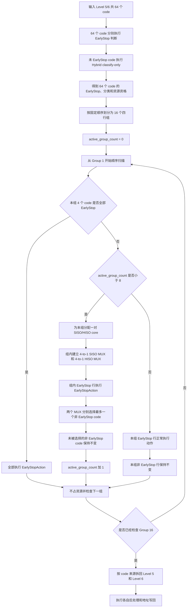

# oFEC 第五/六级固定四行分组共享 MUX 方案

## 1. 文档目的

本文描述一种新的 oFEC 第五级、六级共享解码资源调度方案。

该方案仍然以第五级和第六级合并后的 64 个 code 为输入，但不再让 64 个 code 直接进入统一的全局候选队列竞争资源，而是将其固定划分为 16 个四行组。调度器按组号从前到后扫描，每个满足条件的组获得一对共享资源：一个 SISO 和一个 HISO，并分别通过一个 4-to-1 MUX 从该组的四个 code 中选择输入。

本文用于明确方案的功能逻辑、处理流程、资源关系和状态语义。本文只描述仿真方案，不表示当前代码已经实现该逻辑。

## 2. 方案目标

该方案主要验证以下资源组织方式：

- 第五级和第六级仍然共享 8 个 SISO 和 8 个 HISO；
- 64 个 code 采用固定位置分组，而不是全局自由竞争；
- 每 4 个 code 对应一个逻辑分组；
- 全部 EarlyStop 的组不占用共享译码资源；
- 存在非 EarlyStop code 的组获得一对 SISO/HISO 资源；
- 每个已分配组分别通过一个 4-to-1 SISO MUX 和一个 4-to-1 HISO MUX 选择组内 code；
- 最多为 8 个组分配资源；
- 所有 EarlyStop 命中 code 始终执行正常 EarlyStopAction；
- 未获得译码资源的非 EarlyStop code 保持原状态，不产生新的译码输出。

## 3. 输入与前置处理

### 3.1 共享输入

每次第五/六级共享调用包含 64 个 code：

```text
shared_code[0..63]
```

文档描述时使用 1-based 编号：

```text
code 1, code 2, ..., code 64
```

代码实现时使用 0-based 下标：

```text
shared_code[0], shared_code[1], ..., shared_code[63]
```

### 3.2 EarlyStop 判断

64 个 code 首先分别执行 EarlyStop 判断。

每个 code 得到：

```text
early_stop_hit = true / false
```

EarlyStop 命中的 code：

- 不占用 SISO；
- 不占用 HISO；
- 不参与组内 SISO/HISO MUX 竞争；
- 最终正常执行当前配置的 EarlyStopAction；
- 按现有 EarlyStop 写回语义产生输出。

### 3.3 Hybrid 分类

EarlyStop 未命中的 code 继续执行当前第五/六级共享路径中的 Hybrid classify-only。

分类结果包括：

```text
ParityOnly
OneMain
OneMainPlusParity
TwoMain
Suspicious
HardFail
```

完成该阶段后，64 个 code 都已经具有完整的调度状态：

```text
来源级别
级内行号
共享行号
EarlyStop 命中状态
Hybrid 分类结果
HISO/SISO 资源资格
```

## 4. 固定四行分组

64 个 code 按共享数组中的固定顺序连续分为 16 组，每组 4 个 code。分组过程不根据 EarlyStop 结果、Hybrid 分类结果或 LLR 可靠度重新排列。

| 组号 | code 范围 | 0-based 下标范围 |
| --- | --- | --- |
| Group 1 | code 1-4 | 0-3 |
| Group 2 | code 5-8 | 4-7 |
| Group 3 | code 9-12 | 8-11 |
| Group 4 | code 13-16 | 12-15 |
| Group 5 | code 17-20 | 16-19 |
| Group 6 | code 21-24 | 20-23 |
| Group 7 | code 25-28 | 24-27 |
| Group 8 | code 29-32 | 28-31 |
| Group 9 | code 33-36 | 32-35 |
| Group 10 | code 37-40 | 36-39 |
| Group 11 | code 41-44 | 40-43 |
| Group 12 | code 45-48 | 44-47 |
| Group 13 | code 49-52 | 48-51 |
| Group 14 | code 53-56 | 52-55 |
| Group 15 | code 57-60 | 56-59 |
| Group 16 | code 61-64 | 60-63 |

组号和组内位置在一次共享调用中保持固定：

```text
group_index     = shared_code_index / 4
position_in_mux = shared_code_index % 4
```

## 5. 共享资源结构

该方案使用：

```text
8 个 SISO core
8 个 HISO core
```

资源按成对方式分配给有效组：

```text
资源对 0 = SISO core 0 + HISO core 0
资源对 1 = SISO core 1 + HISO core 1
...
资源对 7 = SISO core 7 + HISO core 7
```

每个资源对分别包含：

```text
一个 4-to-1 SISO MUX
一个 4-to-1 HISO MUX
```

两个 MUX 的四个输入端都来自同一个固定四行组：

```text
                         +----------------+
group code position 0 ---|                |
group code position 1 ---| 4-to-1 SISO MUX|--- SISO core k
group code position 2 ---|                |
group code position 3 ---|                |
                         +----------------+

                         +----------------+
group code position 0 ---|                |
group code position 1 ---| 4-to-1 HISO MUX|--- HISO core k
group code position 2 ---|                |
group code position 3 ---|                |
                         +----------------+
```

资源对编号由有效组被接收的先后顺序决定，不直接等于原始 Group 编号。

例如：

```text
Group 1：全部 EarlyStop，跳过
Group 2：存在非 EarlyStop，分配资源对 0
Group 3：全部 EarlyStop，跳过
Group 4：存在非 EarlyStop，分配资源对 1
```

此时 Group 2 使用 `SISO/HISO core 0`，Group 4 使用 `SISO/HISO core 1`。

## 6. 按组调度逻辑

调度器按照以下固定顺序扫描：

```text
Group 1 -> Group 2 -> ... -> Group 16
```

调度器维护：

```text
active_group_count
```

其初始值为 0，最大值为 8。

### 6.1 全组 EarlyStop

如果一个组内的 4 个 code 全部命中 EarlyStop：

```text
all_early_stop == true
```

则执行：

```text
4 个 code 分别保留 EarlyStopAction
该组不分配 SISO
该组不分配 HISO
active_group_count 不增加
继续检查下一个组
```

因此，全 EarlyStop 组不会消耗 8 对共享资源中的任何一对。

### 6.2 组内存在非 EarlyStop code，且资源对尚未用完

如果组内至少存在一个非 EarlyStop code，并且：

```text
active_group_count < 8
```

则该组被定义为一个已接收的有效组，并执行：

```text
为该组分配 SISO core[active_group_count]
为该组分配 HISO core[active_group_count]
为该组建立一个 4-to-1 SISO MUX
为该组建立一个 4-to-1 HISO MUX
active_group_count += 1
```

组内 EarlyStop 命中的 code 继续执行 EarlyStopAction，不进入两个 MUX。

组内非 EarlyStop code 作为两个 4-to-1 MUX 的候选输入。每个 MUX 最多从该组选择一个 code，因此一个有效组最多同时产生：

```text
1 个 HISODecode
1 个 SISODecode
```

未被两个 MUX 选中的非 EarlyStop code 不执行译码，保持原值。

### 6.3 已经接收 8 个有效组

当：

```text
active_group_count == 8
```

表示 8 对 SISO/HISO 资源已经全部分配。后续组不能再获得新的 SISO/HISO 资源。

对于后续所有组：

```text
EarlyStop 命中 code：正常执行 EarlyStopAction
非 EarlyStop code：不进入 SISO/HISO，保持原值
```

这里不能在第 8 个有效组之后直接退出整个循环。调度器仍然需要继续遍历后续组，以保留后续 code 的 EarlyStopAction。

## 7. Code 最终动作

每个 code 最终只能处于以下四种状态之一：

| 最终动作 | 含义 | 是否占用共享 core | 是否产生新输出 |
| --- | --- | --- | --- |
| `EarlyStopAction` | EarlyStop 命中并执行配置动作 | 否 | 是 |
| `HisoDecode` | 被本组 HISO MUX 选中 | 是，占用一个 HISO | 是 |
| `SisoDecode` | 被本组 SISO MUX 选中 | 是，占用一个 SISO | 是 |
| `Unscheduled` | 非 EarlyStop，但未获得译码资源 | 否 | 否 |

“保持原值”在现有译码框架中的预期语义为：

```text
final_action = Unscheduled
produced = false
不执行 HISO/SISO core
不产生新的 extrinsic 输出
不覆盖该 code 对应的原有 tile/work LLR
不更新该 code 对应的历史信息
```

## 8. 总体流程



## 9. 调度伪代码

以下伪代码只固定已明确的组级逻辑。组内 SISO/HISO 选择函数的具体仲裁规则在文档末尾列为待决策项。

```cpp
int active_group_count = 0;

for (int group_index = 0; group_index < 16; ++group_index) {
  auto rows = get_fixed_four_rows(group_index);

  // 所有 EarlyStop 命中行都保留正常 EarlyStopAction。
  for (auto& row : rows) {
    if (row.early_stop_hit) {
      row.final_action = EarlyStopAction;
      row.assigned_core = -1;
    }
  }

  const bool all_early_stop = all_of(
      rows, [](const auto& row) { return row.early_stop_hit; });

  if (all_early_stop) {
    continue;
  }

  if (active_group_count >= 8) {
    for (auto& row : rows) {
      if (!row.early_stop_hit) {
        row.final_action = Unscheduled;
        row.assigned_core = -1;
      }
    }
    continue;
  }

  const int siso_core = active_group_count;
  const int hiso_core = active_group_count;

  const int hiso_position = select_hiso_mux_input(rows);
  const int siso_position = select_siso_mux_input(
      rows, hiso_position);

  for (int position = 0; position < 4; ++position) {
    auto& row = rows[position];
    if (row.early_stop_hit) {
      continue;
    }

    if (position == hiso_position) {
      row.final_action = HisoDecode;
      row.assigned_core = hiso_core;
    } else if (position == siso_position) {
      row.final_action = SisoDecode;
      row.assigned_core = siso_core;
    } else {
      row.final_action = Unscheduled;
      row.assigned_core = -1;
    }
  }

  ++active_group_count;
}
```

## 10. 示例一：全 EarlyStop 组不占资源

假设前四组状态如下：

```text
Group 1: E E E E
Group 2: E N E E
Group 3: E E E E
Group 4: N N E N
```

其中：

```text
E = EarlyStop 命中
N = 非 EarlyStop
```

分配结果为：

```text
Group 1：全部 EarlyStop，跳过，不占资源
Group 2：分配资源对 0
Group 3：全部 EarlyStop，跳过，不占资源
Group 4：分配资源对 1
```

资源映射：

```text
Group 2 -> SISO core 0 + HISO core 0
Group 4 -> SISO core 1 + HISO core 1
```

## 11. 示例二：达到 8 个有效组后的处理

假设扫描到 Group 10 时，已经有 8 个非全 EarlyStop 组获得资源。此时：

```text
active_group_count = 8
```

Group 11 的状态为：

```text
E N E N
```

则：

```text
两个 E code：执行 EarlyStopAction
两个 N code：Unscheduled，保持原值
Group 11：不分配新的 SISO/HISO
```

Group 12 到 Group 16 仍按照相同方式检查，以保证其中所有 EarlyStop 命中 code 的动作不会丢失。

## 12. 与当前全局共享调度的主要区别

| 项目 | 当前全局共享调度 | 固定四行分组方案 |
| --- | --- | --- |
| 调度单位 | 单个 code | 四个 code 组成的固定组 |
| 候选范围 | 64 个 code 全局排序 | 每个 MUX 只能看到本组 4 个 code |
| 资源分配条件 | 根据全局候选数和分类优先级 | 组内只要存在非 EarlyStop code 即分配一对资源 |
| HISO/SISO 关系 | 分别按全局容量调度 | 一个有效组绑定一个 SISO 和一个 HISO |
| 最大接收单位 | 由 8 个 HISO、8 个 SISO 分别决定 | 最多接收 8 个有效组 |
| EarlyStop 组 | 不进入全局候选队列 | 全组跳过且不占资源对 |
| 容量外 code | `Unscheduled` | 非 EarlyStop code 保持原值 |
| 排序影响 | 分类优先级和 Level 5/6 优先级 | 固定组顺序优先，分类只影响组内 MUX 仲裁 |

## 13. 正确性约束

实现时应保证以下约束：

1. 64 个 code 必须全部具有且仅具有一个最终动作。
2. EarlyStop 命中 code 必须保持 `EarlyStopAction`，不能被改为 HISO、SISO 或 `Unscheduled`。
3. EarlyStop 命中 code 不得占用 SISO/HISO core。
4. 一个有效组最多选择一个 HISO code 和一个 SISO code。
5. 同一个 code 不能同时进入 HISO 和 SISO。
6. HISO core 使用数量不能超过 8。
7. SISO core 使用数量不能超过 8。
8. 获得资源对的组数不能超过 8。
9. 全 EarlyStop 组不能增加 `active_group_count`。
10. 达到 8 个有效组后，后续 EarlyStopAction 仍必须正常执行。
11. `Unscheduled` code 必须保持 `produced=false`，不得覆盖原有 LLR 或历史信息。
12. 4-to-1 MUX 只能选择所属固定组内的 code，不能跨组借用输入。

## 14. 建议统计信息

为验证该方案的资源利用率和 BER 影响，建议至少记录：

```text
每次共享调用中的全 EarlyStop 组数
每次共享调用中的有效组数
达到 8 个有效组限制的调用次数
每个 Group 被分配资源的次数
每个 Group 的 EarlyStop code 数量分布
每个 Group 的非 EarlyStop code 数量分布
实际使用的 HISO core 数量
实际使用的 SISO core 数量
已分配但没有有效输入的 HISO/SISO 数量
Level 5 的 EarlyStop/HISO/SISO/Unscheduled 数量
Level 6 的 EarlyStop/HISO/SISO/Unscheduled 数量
各 Hybrid 分类进入 HISO/SISO/Unscheduled 的数量
Pre-FEC BER 和 Post-FEC BER
```

建议使用相同的 bitgen seed、channel seed、Eb/N0、量化配置和 Chase 参数，与当前全局共享方案进行 A/B 对比。

## 15. 待决策项

以下事项不影响组级框架，但必须在代码实现前确定。

### 15.1 64-code 的固定排列顺序

需要确认共享数组是否继续采用：

```text
code 1-32  = Level 5 row 1-32
code 33-64 = Level 6 row 1-32
```

如果采用该顺序，则 Group 1-8 全部属于 Level 5，Group 9-16 全部属于 Level 6。在前 8 个 Level 5 组均非全 EarlyStop 时，8 对资源可能全部分配给 Level 5，Level 6 的非 EarlyStop code 将全部保持不变。

另一种可选排列是按 Level 5/6 交错或按组交错，但这会改变固定组和两级优先级的含义。

### 15.2 组内 HISO MUX 仲裁规则

当一个组存在多个 HISO-eligible code 时，需要确定 4-to-1 HISO MUX 的选择优先级。

候选规则包括：

```text
按 Hybrid 分类优先级选择
按组内位置 0-3 选择
分类优先，相同分类按组内位置选择
按 LLR 可靠度或其他评分选择
```

### 15.3 组内 SISO MUX 仲裁规则

当一个组存在多个 SISO 候选时，需要确定 4-to-1 SISO MUX 的选择优先级。

尤其需要确定：

```text
Suspicious / HardFail 等 SisoOnly code 是否优先
未被 HISO 选择的 HisoOrSiso code 是否参与 SISO 竞争
相同分类的 code 是否按组内位置选择
```

### 15.4 HISO 和 SISO 的仲裁先后顺序

需要确认组内是：

```text
先选择 HISO，再从剩余 code 中选择 SISO
```

还是：

```text
先选择 SISO，再从剩余 code 中选择 HISO
```

或者两个 MUX 根据一张联合仲裁表同时决定，以避免同一个 code 被两个 MUX 重复选择。

### 15.5 组内只有一个非 EarlyStop code 时的资源路径

如果某组只有一个非 EarlyStop code，需要确定：

```text
HisoOrSiso code 是否优先进入 HISO
HisoOrSiso code 是否优先进入 SISO
是否根据 Hybrid 分类选择路径
```

无论选择哪种方式，同一个 code 都不能同时执行 HISO 和 SISO。

### 15.6 组内存在多于两个非 EarlyStop code 时的处理

一个组最多有 4 个非 EarlyStop code，但只有一个 HISO 和一个 SISO。需要确认未被两个 MUX 选中的 code 是否统一：

```text
final_action = Unscheduled
produced = false
保持原值
```

### 15.7 无有效 HISO 或 SISO 输入时是否仍占用资源对

当前组级规则是：只要组内存在任何非 EarlyStop code，该组就计入 8 个有效组并获得一对资源。

需要确认在以下情况下是否仍然消耗完整资源对名额：

```text
组内所有非 EarlyStop code 都是 SisoOnly，HISO MUX 无有效输入
组内只有一个 HisoOrSiso code，另一路 MUX 无输入
```

### 15.8 “保持不变”的精确写回语义

建议沿用当前 `Unscheduled + produced=false` 语义，但需要确认是否还要求：

```text
不更新 last-tile history
不参与 extrinsic normalize
不参与 alpha 缩放
不计入已译码行数
```

### 15.9 是否需要保留原调度模式作为运行时对照

建议将新方案实现为独立调度模式，而不是覆盖当前 `schedule_level56_rows()` 行为，以便在相同输入和随机种子下对比：

```text
现有全局共享模式
固定四行分组模式
```

对应参数形式可设计为：

```cpp
enum class Level56ScheduleMode : uint8_t {
  GlobalPriority = 0,
  FixedGroup4Mux = 1,
};
```
