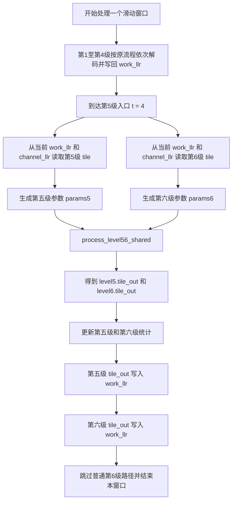
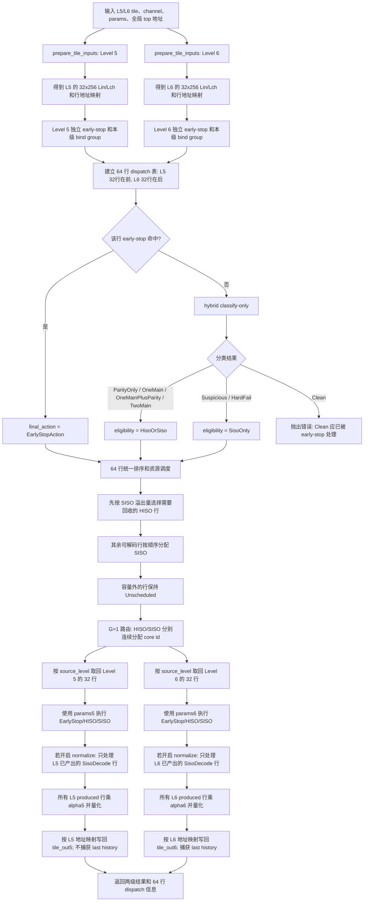
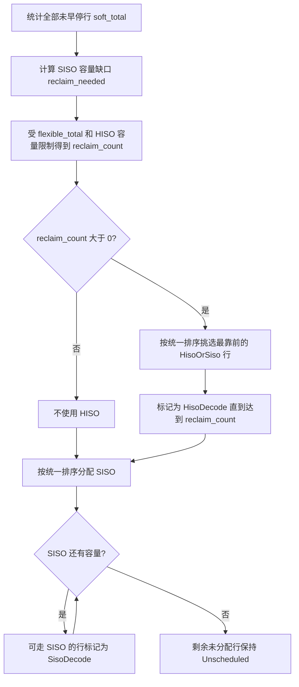
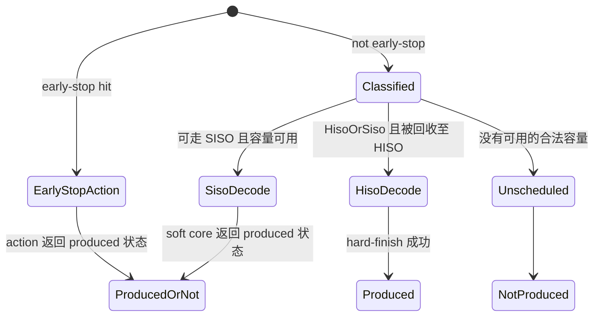

# oFEC 第五/六级共享解码流程（当前实现）

## 1. 文档范围

本文说明当前代码中第五级和第六级启用共享模式后的实际解码流程，重点描述两级内部如何完成：

- 输入准备和 64 行共享调度视图的建立；
- early-stop 与 hybrid classify-only；
- 跨级排序、HISO 回收和 SISO 分配；
- HISO/SISO core 路由与执行；
- 按来源拆回第五级和第六级；
- 分级 normalize、alpha 缩放、量化和地址写回；
- `Unscheduled` 行通过 `produced=false` 保持不写回。

本文描述的是当前代码行为，不再使用“待实现”或“建议方案”的表述。主要实现位于：

```text
src/rx/ofec/detail/ofec_decode_impl.ipp
src/rx/ofec/detail/ofec_window_impl.ipp
src/rx/ofec/detail/ofec_level56_shared.ipp
src/rx/ofec/detail/ofec_tile_input.ipp
src/rx/ofec/detail/ofec_tile_decode.ipp
src/rx/ofec/detail/ofec_tile_writeback.ipp
```

## 2. 一句话概括

第五级和第六级仍分别准备各自的 32 行输入，但把两级共 64 行的分类结果、资源资格和调度状态放到一个共享表中，统一竞争一组 HISO/SISO 资源；执行时再按来源级别分别使用各自的 beta，执行后分别 normalize、乘各自的 alpha，并按各自地址映射写回。

因此，共享和独立的边界如下：

| 阶段                                    | 第五/六级关系                                                |
| --------------------------------------- | ------------------------------------------------------------ |
| 从`work_llr`、`channel_llr` 取 tile | 分别进行                                                     |
| `prepare_tile_inputs()`               | 分别进行                                                     |
| early-stop 检测和 bind group            | 分别进行，bind 不跨级                                        |
| hybrid classify-only 结果               | 合入同一张 64 行调度表                                       |
| 分类优先级和跨级优先级                  | 统一处理                                                     |
| HISO/SISO 容量                          | 两级共享                                                     |
| core 编号分配                           | 两级统一编号                                                 |
| HISO/SISO 实际执行                      | 按来源级别分别执行                                           |
| SISO beta                               | 使用来源级别自己的 beta                                      |
| normalize                               | 开启时，第五、六级分别统计和缩放，只包含本级已产出的 SISO 行 |
| alpha 和量化                            | 使用来源级别自己的参数                                       |
| 地址映射和 tile 写回                    | 分别进行                                                     |
| `last_tile_history_accum`             | 只由第六级捕获，因为第六级是最后一个 soft tile               |

## 3. 启用条件和资源配置

共享模式由以下参数控制：

```cpp
LEVEL56_SHARED_ENABLE
LEVEL56_SHARED_HISO_ACTIVE
LEVEL56_SHARED_SISO_ACTIVE
LEVEL56_PRIORITY_MODE
LEVEL56_FAIR_ALTERNATE_START
```

启用后，当前实现要求：

```text
TILES_PER_WIN == 6
CHASE_SBR == 2
TILE_OVERLAP_BR == 0
MUX_GROUP_G == 1
0 <= LEVEL56_SHARED_HISO_ACTIVE <= 64
0 <= LEVEL56_SHARED_SISO_ACTIVE <= 64
```

第五级和第六级还必须满足：

- 都是 soft tile；
- 都启用 early-stop；
- 都启用 hybrid；
- classifier 必须是 classify-only 模式，不能使用 `LegacyHardDecode`；
- 除 `ALPHA_LIST[4/5]`、`beta_list[4/5]` 外，两级相关公共参数必须一致。

当前校验会比较两级的 early-stop enable、condition、action、bind group size、early-stop action sign beta、hybrid enable 和 hard LLR magnitude。classifier mode 等没有按级列表的参数天然来自同一个全局 `Params`，所以第五级和第六级使用同一值。

共享模式下，第五/六级不再使用 `SISO_ACTIVE_LIST[4/5]` 和 `HIHO_ACTIVE_LIST[4/5]` 表示各自容量。两级总容量只由 `LEVEL56_SHARED_SISO_ACTIVE` 和 `LEVEL56_SHARED_HISO_ACTIVE` 控制；原有 active list 只要求覆盖前四级。

## 4. 窗口内的总体流程

前四级继续走原来的逐 tile 解码路径。窗口循环到 `t == 4` 时，不再单独处理第五级，而是一次取出第五级和第六级，调用一次 `process_level56_shared()`；完成后跳过普通的 `t == 5` 路径。



第五级和第六级的 tile 输入都在任何一级写回之前完成快照。当前地址映射保证第六级输入不依赖第五级本次即时写回，因此两份输入可以并列准备。

主 decode 路径维护一个 `level56_shared_invocation`：

```text
decode 开始时置 0
每处理一个窗口的第五/六级共享批次后加 1
不在新窗口重新置 0
```

该编号目前只影响 `Fair` 模式是否交替起始级。未来并行化时不要求依赖该编号记录执行顺序。

## 5. 第五/六级共享内部总流程图

下面是 `process_level56_shared()` 内部的完整主流程。



## 6. 输入准备：两级独立，调度元数据合并

### 6.1 每级 32 行的来源

当前固定 `CHASE_SBR == 2`，每个 subblock row 含 16 行，因此每级准备：

```text
2 x 16 = 32 个 decoder row
每行是一个 256 位 BCH codeword 的 Lin/Lch 向量
```

第五级和第六级分别调用 `prepare_tile_inputs()`，分别得到一个 `TilePrepared`：

```text
prep5.lin_matrix       32 x 256
prep5.lch_matrix       32 x 256
prep5.row_local_lookup 32 entries
prep5.row_global_lookup 32 entries
prep5.params_for_core  含 beta5、alpha5 和 L5 trace 映射

prep6.lin_matrix       32 x 256
prep6.lch_matrix       32 x 256
prep6.row_local_lookup 32 entries
prep6.row_global_lookup 32 entries
prep6.params_for_core  含 beta6、alpha6 和 L6 trace 映射
```

`Lin` 是信道项与当前先验/历史项组合后的 core 输入，`Lch` 只保留信道项。两级 tile 的顶部全局地址不同，所以读取映射和最终写回映射必须各自保存。

### 6.2 共享表只保存调度信息

代码没有把 `prep5.lin_matrix` 和 `prep6.lin_matrix` 物理拼成一个 `64 x 256` 矩阵送入一次 decoder core。它建立的是 64 个 `Level56DispatchEntry`：

```text
entries[0..31]  来自 Level 5 local row 0..31
entries[32..63] 来自 Level 6 local row 0..31
```

每个 entry 保存：

| 字段                  | 含义                                            |
| --------------------- | ----------------------------------------------- |
| `shared_row`        | 在 64 行共享表中的稳定索引                      |
| `source_level`      | 来源级别，5 或 6                                |
| `source_local_row`  | 来源级别内部的 decoder row，0 到 31             |
| `source_global_row` | 对应的全局行地址                                |
| `early_stop_hit`    | 是否被本级 early-stop 命中                      |
| `hybrid_class`      | classify-only 的分类结果                        |
| `eligibility`       | 可使用 HISO、SISO，还是二者均可                 |
| `final_action`      | 最终执行 EarlyStop、HISO、SISO 或 Unscheduled   |
| `assigned_core`     | 路由后获得的 HISO/SISO core 编号；未路由时为 -1 |

`source_level` 和 `source_local_row` 从建立以后一直保留到执行和写回，确保两级共享资源后仍能恢复来源语义。

## 7. Early-stop：每级独立判断

第五级和第六级分别调用 `detect_level56_early_stop()`。处理顺序是：

```text
检测本级 32 行的 raw early-stop
    -> 如果 condition mode = 1 且 bind group size > 1
       则只在本级 32 行内部应用 group binding
    -> 得到 effective early-stop flags
```

因为两级分开调用，bind group 不可能跨过第五/六级边界。例如 group size 为 4 时，合法分组是：

```text
L5[0..3], L5[4..7], ..., L5[28..31]
L6[0..3], L6[4..7], ..., L6[28..31]
```

early-stop 命中的行直接设置：

```text
early_stop_hit = true
final_action = EarlyStopAction
```

这些行不再进入 hybrid 分类，不参与 HISO/SISO 容量竞争，也不分配共享 core。

## 8. Hybrid classify-only 与资源资格

对每个未 early-stop 的行，代码从对应 `prep.lin_matrix` 取出 256 个 `Lin`，调用 classify-only classifier。该阶段只分类，不翻 bit、不执行最终 hard decode，也不生成可写回输出。

当前分类到资源资格的映射是：

| Hybrid 分类           | 分类优先级 | 资源资格       |
| --------------------- | ---------: | -------------- |
| `ParityOnly`        |    0，最高 | `HisoOrSiso` |
| `OneMain`           |          1 | `HisoOrSiso` |
| `OneMainPlusParity` |          2 | `HisoOrSiso` |
| `TwoMain`           |          3 | `HisoOrSiso` |
| `Suspicious`        |          4 | `SisoOnly`   |
| `HardFail`          |    5，最低 | `SisoOnly`   |

当前共享入口不会产生 `HisoOnly` 行。前四类既能由 HISO hard-finish，也能由 SISO 解码；后两类只能走 SISO。

`Clean` 不属于共享调度中的正常分类。按当前设计，clean 行应该已经在前面的 early-stop 中完成处理；如果一个未 early-stop 行被 classify-only 返回为 `Clean`，代码立即抛出运行时错误，而不是继续分配资源。

## 9. 统一排序规则

调度前先生成 64 行候选顺序。排序有两层，先比较分类，再比较第五/六级优先级。

第一层分类顺序固定为：

```text
ParityOnly
  -> OneMain
  -> OneMainPlusParity
  -> TwoMain
  -> Suspicious
  -> HardFail
```

第二层只在同一个分类内部决定第五级和第六级如何排列：

| 模式            | 同一分类内的跨级顺序                             |
| --------------- | ------------------------------------------------ |
| `Level5First` | 所有 L5 行在前，再放所有 L6 行                   |
| `Level6First` | 所有 L6 行在前，再放所有 L5 行                   |
| `Fair`        | L5/L6 交替取一行；起始级由配置和 invocation 决定 |

无论使用哪种跨级模式，同一级、同一分类内部始终按 `source_local_row` 从小到大排列。

`Fair` 模式的起始规则如下：

```text
LEVEL56_FAIR_ALTERNATE_START = false:
    每个共享批次都从 Level 5 开始交替

LEVEL56_FAIR_ALTERNATE_START = true:
    偶数 shared_invocation 从 Level 5 开始
    奇数 shared_invocation 从 Level 6 开始
```

该起始级会应用到本次 invocation 的每个分类组。某一级在某个分类中没有候选时，调度器直接取另一级，不保留空槽。

## 10. SISO 优先和 HISO 回收算法

当前算法的核心语义是：所有未 early-stop 行默认优先考虑 SISO，HISO 只接管 SISO 容量装不下的溢出行，并且只能接管 `HisoOrSiso` 行。

先统计：

```text
soft_total     = 所有未 early-stop 行数
flexible_total = 其中 eligibility == HisoOrSiso 的行数
siso_capacity  = LEVEL56_SHARED_SISO_ACTIVE
hiso_capacity  = LEVEL56_SHARED_HISO_ACTIVE
```

然后计算：

```text
reclaim_needed = max(soft_total - siso_capacity, 0)
reclaim_count  = min(reclaim_needed, flexible_total, hiso_capacity)
```

调度分两轮完成：

1. 按统一候选顺序扫描，把最前面的 `reclaim_count` 个 `HisoOrSiso` 行标记为 `HisoDecode`。
2. 再按同一顺序扫描，把尚未分配且允许 SISO 的行依次标记为 `SisoDecode`，直到 SISO 容量用完；其余行保持 `Unscheduled`。



### 10.1 SISO 容量为 64 的行为

两级总共最多 64 行，其中 early-stop 行还不占用 SISO。因此配置：

```text
LEVEL56_SHARED_SISO_ACTIVE = 64
```

必然得到：

```text
soft_total <= 64
reclaim_needed = 0
reclaim_count = 0
```

所以 HISO 不处理任何行。即使 `LEVEL56_SHARED_HISO_ACTIVE` 也配置为 64，最终仍是 SISO 优先，HISO 只作为 SISO 溢出资源存在。

### 10.2 容量不足时的状态

若 `HISO + SISO` 总容量不足，或者 SISO-only 行太多而 SISO 容量不足，排在容量之外的行会成为 `Unscheduled`。调度器不会把 `SisoOnly` 行错误地分配给 HISO，也不会在本次 invocation 内回填、补位或重试。

## 11. G=1 路由

当前共享模式固定要求 `MUX_GROUP_G == 1`，因此路由是一个全局池：

```text
按统一候选顺序扫描 final_action
    HisoDecode -> 分配 HISO core 0, 1, 2, ...
    SisoDecode -> 分配 SISO core 0, 1, 2, ...
```

HISO 和 SISO 各自维护独立的 core 编号。`EarlyStopAction` 和 `Unscheduled` 不进入 MUX，`assigned_core` 保持 `-1`。

调度阶段已经保证使用量不超过共享容量，所以 G=1 路由只做一次 code-to-core 编号映射，不再改变优先级和最终动作，也没有路由失败后的二次调度。

## 12. 按来源执行：第五级和第六级分别跑一个 slice

完成统一调度和路由后，代码分别调用：

```text
execute_level56_slice(prep5, entries, source_level=5, ...)
execute_level56_slice(prep6, entries, source_level=6, ...)
```

每个 slice 都创建一张本级 `32 x 256` 的结果矩阵和 32 个 `produced_rows` 标志，只处理 `source_level` 与本级相同的 entry。

### 12.1 四种 final action 的执行行为

| `final_action`    | 本级执行动作                                           | 是否占共享 core | `produced`                                                 |
| ------------------- | ------------------------------------------------------ | --------------- | ------------------------------------------------------------ |
| `EarlyStopAction` | 用本级`Lin/Lch` 执行配置的 early-stop action         | 否              | 由 action 返回值决定；大多数模式为 true，mode 3 可能为 false |
| `HisoDecode`      | 按`hybrid_class` 执行对应 hard-finish                | HISO            | 成功后为 true；失败抛出异常                                  |
| `SisoDecode`      | 将本级该行状态设为`NeedSiso`，交给 soft decoder core | SISO            | 只有 soft core 实际产出后才为 true                           |
| `Unscheduled`     | 不执行，不清零，不复制新结果                           | 否              | false                                                        |

### 12.2 HISO 行

HISO 行根据 classify-only 阶段保存的分类执行 `execute_hybrid_hard_class()`。执行使用来源级别自己的 `prep.params_for_core`，但共享模式已经要求两级 hard-finish 相关公共参数一致。

hard-finish 成功后，256 个输出写入本级结果矩阵，并把该行 `produced_rows[row]` 置为 true。

### 12.3 SISO 行

本级先构造 32 行 soft state：

```text
SisoDecode 行 -> NeedSiso
其他行        -> Unscheduled
```

然后以本级完整的 `lin_matrix`、`lch_matrix` 和 `params_for_core` 调用一次 soft decoder core。core 只为 `NeedSiso` 行解码。

因此：

- Level 5 SISO 使用 `beta_list[4]` 生成的 `params5.beta`；
- Level 6 SISO 使用 `beta_list[5]` 生成的 `params6.beta`；
- 两级不是用一个 64 行 core 调用，也不会混用 beta；
- 只有 soft core 返回 `produced=true` 的目标行才复制到最终本级结果。

## 13. 分级 normalize、alpha 和量化

第五级和第六级执行完成后，各自在自己的 `32 x 256` 结果上调用后处理。顺序固定为：

```text
如果 normalize_extrinsic=true：
    本级 SisoDecode 且 produced=true 的行参与 normalize
    -> 本级所有 produced=true 的行乘本级 alpha
    -> 本级所有 produced=true 的行执行输出量化

如果 normalize_extrinsic=false：
    跳过 normalize
    -> 本级所有 produced=true 的行乘本级 alpha
    -> 本级所有 produced=true 的行执行输出量化
```

### 13.1 Normalize 的范围

当 `normalize_extrinsic=true` 时，`normalize_rows` 只在本级 `SisoDecode` 行上置 true，实际归一化还会同时检查 `produced_rows`。因此参与第五级归一化统计和缩放的集合是：

```text
source_level == 5
&& final_action == SisoDecode
&& produced == true
```

第六级同理。两级分别计算各自的平均绝对幅度和 scale，不会把 L5/L6 SISO 行放在一起计算一个 64 行 scale。

`EarlyStopAction`、`HisoDecode` 和 `Unscheduled` 都不参与 normalize；其中前两类如果 produced=true，仍会进入后续 alpha 和量化。

### 13.2 Alpha 的范围

Normalize 完成后，后处理对本级所有 `produced=true` 行乘 alpha：

```text
Level 5 produced 行乘 ALPHA_LIST[4]
Level 6 produced 行乘 ALPHA_LIST[5]
```

这一步不只作用于 SISO 行，也作用于本级已产出的 early-stop 和 HISO 行。最后再按当前 LLR 类型执行量化或裁剪。

## 14. 分级地址写回和历史信息

两个输出 tile 都先复制对应输入：

```text
tile_out5 = tile_in5
tile_out6 = tile_in6
```

随后分别调用 `writeback_tile()`：

```text
Level 5: writeback_tile(prep5, decoded5, params5, top5,
                        capture_last_tile_history=false)

Level 6: writeback_tile(prep6, decoded6, params6, top6,
                        capture_last_tile_history=true)
```

写回使用每级 `TilePrepared` 中自己的 `row_local_lookup`、`row_global_lookup` 和 tile top 地址，把 256 位线性输出重新映射到本级二维 tile。

### 14.1 `produced=false` 的隐式传播

`writeback_tile()` 对每一行检查 `produced_rows`。只有 `produced=true` 才覆盖 `tile_out`，也只有 `produced=true` 才更新 `last_tile_history_accum`。

因此 `Unscheduled` 行的完整行为是：

```text
不执行 decoder
-> produced=false
-> 不 normalize
-> 不乘 alpha、不量化有效输出
-> 不覆盖 tile_out
-> 不更新 last_tile_history_accum
-> 原 tile_in 内容随 tile_out 保留下来
```

这里不需要为 `Unscheduled` 额外执行 clear、copy 或 history 修复；`produced=false` 已经提供所需的隐式传播语义。

### 14.2 为什么只由第六级捕获 history

共享配置要求第五、六级都是 soft tile，并且第六级是窗口内最后一个 soft tile。为保持原有逐 tile 路径的最终 history 语义：

- 第五级结果正常写回自己的 `tile_out5`，但不捕获 `last_tile_history_accum`；
- 第六级结果写回 `tile_out6`，同时对 produced 行捕获最后一级 history；
- 外层再把第五级、随后第六级的 `tile_out` 写回全局 `work_llr`。

整帧 decode 完成所有窗口后，最终输出仍按原流程由 `channel_llr + last_tile_history_llr` 合成。

## 15. 行状态守恒

每个 shared entry 最终只属于以下四种动作之一：

```text
EarlyStopAction
HisoDecode
SisoDecode
Unscheduled
```

状态转移可以概括为：



调度器还会检查：

- early-stop 命中与 `EarlyStopAction` 一一对应；
- HISO 不接收无 HISO 资格的行；
- SISO 不接收无 SISO 资格的行；
- 两级合计 HISO/SISO 数量不超过共享容量。

## 16. 一个容量示例

假设某个共享批次中：

```text
early-stop              = 8 行
未 early-stop            = 56 行
其中 HisoOrSiso          = 30 行
其中 SisoOnly            = 26 行
shared SISO capacity     = 48
shared HISO capacity     = 8
```

则：

```text
soft_total     = 56
reclaim_needed = 56 - 48 = 8
reclaim_count  = min(8, 30, 8) = 8
```

调度结果是：

```text
按分类和跨级策略排序后最靠前的 8 个 HisoOrSiso -> HisoDecode
剩余 48 个未早停行                              -> SisoDecode
Unscheduled                                      -> 0 行
```

若 HISO capacity 改为 4，则只有 4 行被 HISO 回收，SISO 仍最多处理 48 行，最终有 4 行 `Unscheduled`。具体落在哪一级、哪些 local row，由分类优先级、`LEVEL56_PRIORITY_MODE` 和本级 local row 顺序共同决定。

## 17. 代码调用关系

```text
ofec_decode_llr_impl
  -> 为整个 decode 创建 level56_shared_invocation
  -> 对每个 window 调用 process_window_impl
       -> 前四级调用原 process_tile_impl
       -> t == 4 时调用 process_level56_shared
            -> prepare_tile_inputs(L5)
            -> prepare_tile_inputs(L6)
            -> detect_level56_early_stop(L5/L6)
            -> append_level56_entries(L5/L6)
            -> schedule_level56_rows
            -> route_level56_g1
            -> execute_level56_slice(L5)
            -> execute_level56_slice(L6)
            -> writeback_tile(L5, capture_history=false)
            -> writeback_tile(L6, capture_history=true)
            -> build_level56_tile_result(L5/L6)
       -> 将两个 tile_out 依次覆盖回 work_llr
```

## 18. 当前实现的关键结论

1. 第五级和第六级共享的是 64 行统一优先级、HISO/SISO 总容量和 core 编号，不共享一张物理 decoder 输入矩阵。
2. 两级输入在任一级写回之前分别准备，第六级不依赖第五级本次即时写回。
3. clean 行由 early-stop 提前处理，classify-only 再返回 `Clean` 会被视为实现或配置错误。
4. 固定分类优先级为 `ParityOnly -> OneMain -> OneMainPlusParity -> TwoMain -> Suspicious -> HardFail`。
5. 同一分类、同一级内部固定按 `source_local_row` 从小到大排序。
6. SISO 是默认路径；HISO 只接管 SISO 溢出，而且只接管 `HisoOrSiso` 行。
7. `Shared SISO=64` 时 `reclaim_count=0`，不会使用 HISO。
8. SISO 执行按来源分别使用 beta；开启 normalize 时，两级分别 normalize 自己已产出的 SISO 行。
9. 每级所有 produced 行再乘本级 alpha、量化，并按本级地址映射写回。
10. `Unscheduled` 通过 `produced=false` 保持输入和 history，不需要额外处理。
11. 第五级不捕获最后一级 history，第六级捕获 produced 行的 history。
12. 主 decode 中 `shared_invocation` 跨窗口全局递增，只用于当前串行 `Fair` 起始级交替。
